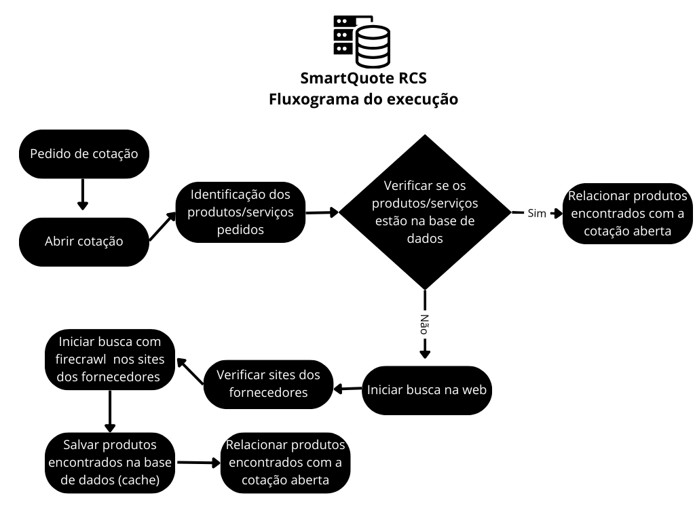

# 🚀 SmartQuote - Hackathon RCS

<div align="center">
  
  
  **Sistema Inteligente de Gestão de Cotações com IA**
  
  [](https://nodejs.org/)
  [](https://www.typescriptlang.org/)
  [](https://reactjs.org/)
  [](https://www.python.org/)
  [](LICENSE)
</div>

## 📋 Sobre o Projeto

Este repositório contém **três componentes paralelos** que constituem o sistema completo SmartQuote, uma solução inovadora de gestão de cotações desenvolvida para a RCS Angola. Cada componente está em seu próprio diretório e pode ser executado independentemente.

## ⚠️ Observações Importantes para os Jurados

<div style="background-color: #FFF3CD; padding: 15px; border-left: 5px solid #FFC107; margin-bottom: 20px; border-radius: 4px;">
  <strong>Limitações dos Serviços Gratuitos:</strong>
  
  1. <strong>APIs de IA:</strong> Tanto a busca local (na base de dados) quanto a busca externa (web) dependem de tokens de serviços de IA (GROQ, OpenAI, etc). Como estamos utilizando planos gratuitos, podem ocorrer falhas temporárias se atingirmos o limite de requisições (rate limit) ou o limite de tokens disponíveis.
  
  2. <strong>Hospedagem:</strong> Os aplicativos estão hospedados no Render, um serviço gratuito que coloca as aplicações em "sleep mode" após períodos de inatividade. Se notar um tempo de carregamento inicial maior, isso é esperado - o serviço está "acordando" e reiniciando as aplicações.
  
  <strong>Solicitamos compreensão caso encontrem alguma destas limitações durante a avaliação.</strong>
</div>

### Credenciais de Acesso para Avaliação

```
Email: hudsonjrmateque@gmail.com
Senha: Teste123@
```
```
COTAÇÃO VIA EMAIL TESTE: smartquotercs@gmail.com
```
## 🗂️ Estrutura do Repositório

Este repositório contém três subrepositórios paralelos:

```
hackathon-smartquote/
├── frontend_repo/       # Interface do usuário em React
├── backend_repo/        # API REST em Node.js/TypeScript
└── smartQuote-python/   # API Python de busca com IA
```

## 🌐 Componentes do Sistema

### 1. Frontend (frontend_repo)

Interface do usuário moderna e responsiva desenvolvida com React, TypeScript e Tailwind CSS.

**Principais Características:**
- 🤖 **IA Integrada** - Busca automática de produtos e sugestões inteligentes
- 📊 **Dashboard Analytics** - Métricas em tempo real e relatórios detalhados
- 🔒 **Sistema de Permissões** - Controle de acesso baseado em funções
- 📱 **Responsivo** - Interface adaptável para desktop, tablet e mobile
- 🔄 **Tempo Real** - Notificações e atualizações instantâneas
- 📄 **Exportação** - Relatórios em PDF, Excel e CSV

[Saiba mais sobre o Frontend](./frontend_repo/README.md)

### 2. Backend (backend_repo)

API RESTful desenvolvida em Node.js e TypeScript, responsável por gerenciar as principais funcionalidades do SmartQuote.

**Principais Características:**
- 🔐 **Autenticação** - Sistema de login e gerenciamento de usuários com tokens
- 📦 **Gerenciamento de Cotações** - CRUD completo para cotações e itens
- 🔍 **Busca de Produtos** - Busca interna e externa via API Python
- 🔄 **Integração com Dynamics** - Sincronização com Microsoft Dynamics ERP
- 📧 **Monitoramento de E-mail** - Worker para processar cotações automaticamente
- 🤖 **IA Generativa** - Integração com Google Gemini para interpretação de dados
- 🔔 **Notificações** - Sistema para alertar usuários sobre eventos importantes
- 📊 **Relatórios** - Geração de relatórios em XLSX e CSV

[Saiba mais sobre o Backend](./backend_repo/README.md)

### 3. API Python (smartQuote-python)

API Flask independente para processamento de interpretações e busca híbrida de produtos.

**Principais Características:**
- 🏗️ **Arquitetura Desacoplada** - API Python independente da API Node.js
- 🚀 **Deploy Isolado** - Pode ser hospedada em qualquer servidor/cloud
- ⚡ **Escalabilidade Horizontal** - Múltiplas instâncias com load balancing
- 🔄 **Zero Dependências** - Apenas Weaviate, Supabase e GROQ
- 📊 **Sistema de Auditoria** - Rastreabilidade completa de todas as análises e decisões
- 🔍 **Busca Híbrida** - Combinação de busca vetorial e textual para resultados precisos

[Saiba mais sobre a API Python](./smartQuote-python/README.md)

## ⚠️ Fluxograma do Core da Aplicação

<div align="center">
  
</div>

O fluxograma acima ilustra o processo central do SmartQuote:

1. **Pedido de Cotação** - O processo inicia com um pedido de cotação
2. **Abrir Cotação** - Sistema cria um novo processo de cotação
3. **Identificação dos Produtos/Serviços** - A IA analisa e identifica os produtos solicitados
4. **Verificação na Base de Dados** - Sistema verifica se os produtos existem no banco de dados
5. **Se Encontrados** - Os produtos são associados à cotação aberta
6. **Se Não Encontrados** - Inicia-se busca na web usando firecrawl nos sites dos fornecedores
7. **Produtos Encontrados** - São salvos na base de dados para uso futuro (cache)
8. **Finalização** - Os produtos são relacionados à cotação aberta

Este fluxo demonstra como o SmartQuote utiliza inteligência artificial para automatizar o processo de busca e comparação de produtos, otimizando o tempo e aumentando a precisão das cotações.

## 🚀 Início Rápido

### Configuração Completa

1. **Clone o repositório**
   ```bash
   git clone https://github.com/smartquote-rcs/hackathon-smartquote.git
   cd hackathon-smartquote
   ```

2. **Configure cada componente**
   
   Siga as instruções de instalação em cada README específico dos componentes:
   - [Instruções do Frontend](./frontend_repo/README.md)
   - [Instruções do Backend](./backend_repo/README.md)
   - [Instruções da API Python](./smartQuote-python/README.md)


## 🏢 Sobre a RCS

A **RCS** é uma empresa líder em soluções tecnológicas em Angola, oferecendo:

- 💼 **Consultoria em TI**
- 🖥️ **Soluções de Hardware**
- ☁️ **Serviços em Nuvem**
- 🔧 **Suporte Técnico 24/7**

### 📞 Contato

- **Website**: [https://smartquote-rcs-front-end.onrender.com/](https://smartquote-rcs-front-end.onrender.com/) *(Nota: O primeiro acesso pode demorar até 30 segundos enquanto o serviço gratuito Render reinicia a aplicação)*


<div align="center">
  <strong>Desenvolvido por Devs da 42 Luanda</strong>
  <br />
  <small>© 2025 RCS Angola. Todos os direitos reservados.</small>
</div>
